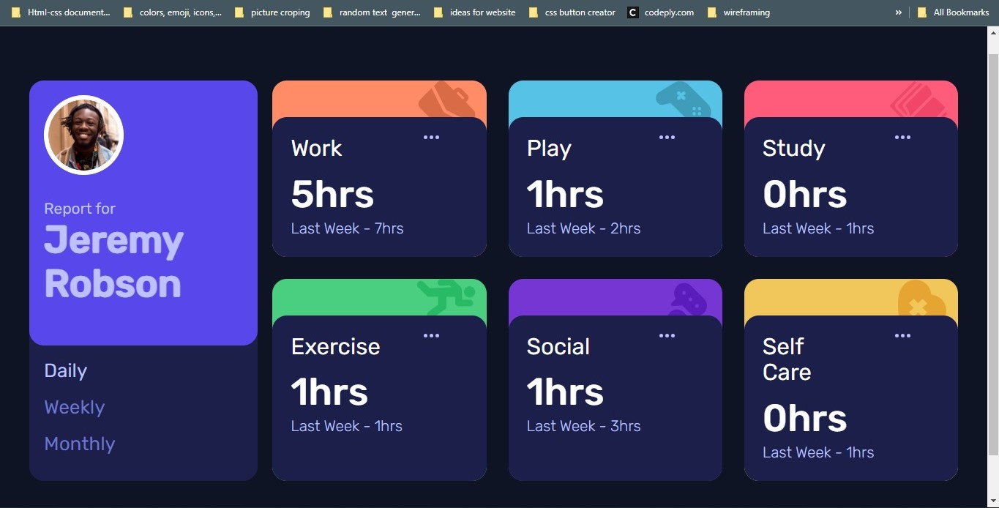

# Frontend Mentor - Time tracking dashboard solution

This is a solution to the [Time tracking dashboard challenge on Frontend Mentor](https://www.frontendmentor.io/challenges/time-tracking-dashboard-UIQ7167Jw). Frontend Mentor challenges help you improve your coding skills by building realistic projects. 

## Table of contents

- [Overview](#overview)
  - [The challenge](#the-challenge)
  - [Screenshot](#screenshot)
  - [Links](#links)
- [My process](#my-process)
  - [Built with](#built-with)
  - [What I learned](#what-i-learned)
  - [Continued development](#continued-development)
  - [Useful resources](#useful-resources)
- [Author](#author)
- [Acknowledgments](#acknowledgments)

## Overview

### The challenge

Users should be able to:

- View the optimal layout for the site depending on their device's screen size
- See hover states for all interactive elements on the page
- Switch between viewing Daily, Weekly, and Monthly stats

### Screenshot

### Links

- Solution URL: (https://github.com/Praixx/time-tracking-dashboard-main)
- Live Site URL: (https://dainty-sunflower-87afc4.netlify.app/)

## My process

### Built with

- Semantic HTML5 markup
- CSS custom properties
- Flexbox
- CSS Grid
= Javascript

### What I learned

i had so much fun working on this because i was able to learn more about asyncronous javascript and working with externaml json file. i was also able to impliment the keyup or the key down funtion to change the controls and give you the data from each selected controls. i also learnt more about using conditional iteration. and i was also able to make the code as efficient as possible and also tried to fix any bug that could occur from when the user is using it.

### Continued development

### Useful resources

## Author
- Github - [Olaoye Praise](https://github.com/Praixx)
- Email - (praix1y@gmail.com)
- Twitter - [@Praixx_](https://www.twitter.com/Praixx_)

## Acknowledgments

